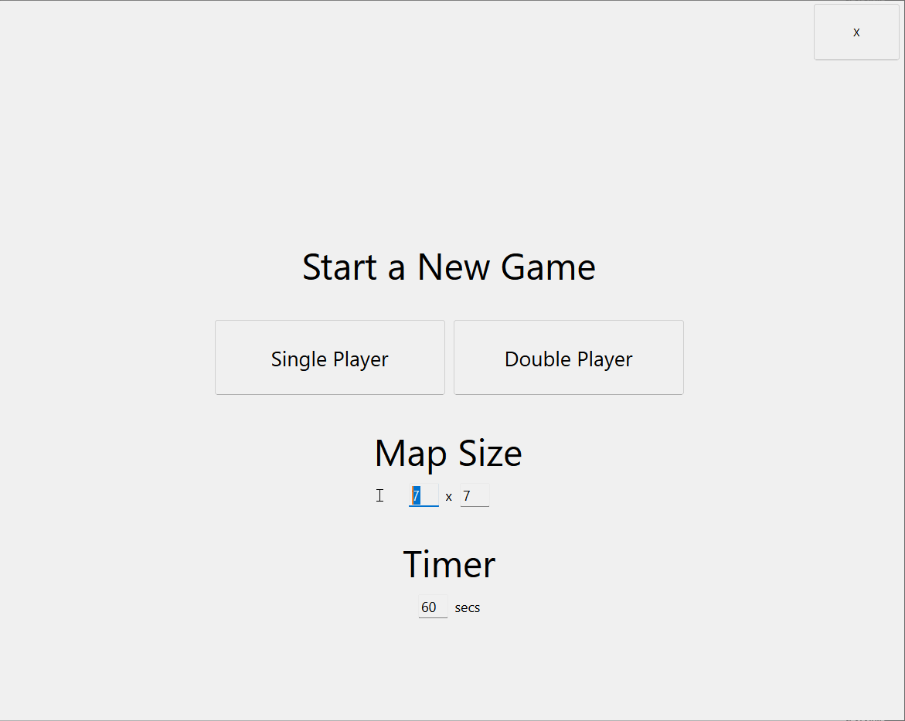
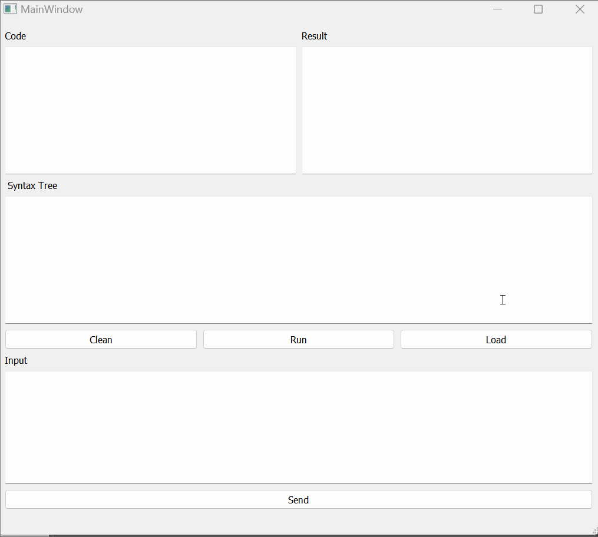

# SE1301 Software Engineering Practice

## Course Overview

This course, SE1301, focuses on mastering Object-Oriented Programming (OOP), data structures, and algorithms through practical labs and projects in C++. The coursework includes two major projects and eight medium-to-hard level labs.

### Project 1: QFlags
- Develop an RPG-style puzzle game (Pair Match) with Qt, focusing on strong class modularity, interface design, edge case considerations, and testing. Players navigate a map with single/double game modes, collect props (like shuffling blocks or countdown increase), and earn points.

### Project 2: QBasic
- Develop a Minimal BASIC interpreter with Qt, including GUI interaction, syntax tree construction, code evaluation, and error handling, emphasizing object-oriented design and thorough testing.

## Labs

- Lab 1: Read student and course information from text files and use object-oriented principles to process and calculate student scores and GPAs.
- Lab 2: Implement a simplified C++ text editor with basic text editing functions and file operations, focusing on linked lists, command parsing, and file I/O.
- Lab 3: Develop a Tower of Hanoi game in C++, emphasizing interactive play, automatic solutions, and handling illegal inputs using stacks and queues.
- Lab 4: Create a program using a Binary Diamond Tree for finding nearest nodes, focusing on tree data structures.
- Lab 5: Develop a command-line Boggle game focusing on recursive search algorithms (DFS) for word formation and validation.
- Labs 6-7: Engage in finding, correcting, and reporting various kinds of bugs in code using debugging techniques.

## Acknowledgements
A special thanks to the faculty and teaching assistants at SJTU for their guidance and support throughout these courses.